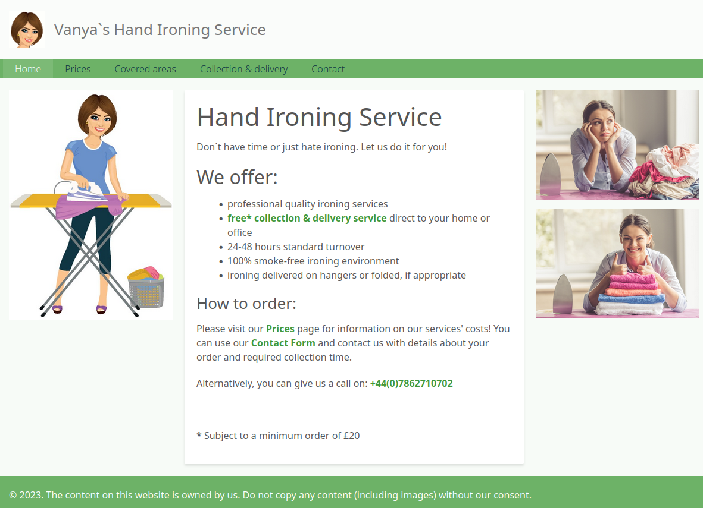

<h1 align="center">Handironingservice</h1>

 
<h2><a href="https://www.handironingservice.co.uk/" target="_blank"">View the site</a></h2> 

<a href="#description">Description</a> &bull; <a href="#screenshots">Screenshots</a> &bull; <a href="#license">License</a> &bull; <a href="#questions">Questions</a> &bull; <a href="#acknowledgments">Acknowledgments</a>

<h2 id="description">🧾 Description</h2>

Drupal website created for a customer to address the client business reuqirements.

(<a href="#readme-top">back to top</a>)

<h2 id="screenshots"> 🖼️ Screenshots</h2>

(<a href="#readme-top">back to top</a>)

<h2 id="built-with">🛠️ Built with</h2>

(<a href="#readme-top">back to top</a>)

<h2 id="license">🔍 License</h2>

(<a href="#readme-top">back to top</a>)

<h2 id="questions">❓ Questions</h2>

You can reach me for any questions on the github repo page: [https://github.com/apyosi/handironingservice-public](https://github.com/apyosi/handironingservice-public)

(<a href="#readme-top">back to top</a>)

<h2 id="questions">💌 Acknowledgments</h2>

Use this space to list resources you find helpful and would like to give credit to!

* [Best README Template](https://github.com/othneildrew/Best-README-Template)
* [Badges 4 README.md Profile](https://github.com/alexandresanlim/Badges4-README.md-Profile)
* [Markdown License badges](https://gist.github.com/lukas-h/2a5d00690736b4c3a7ba)

(<a href="#readme-top">back to top</a>)

